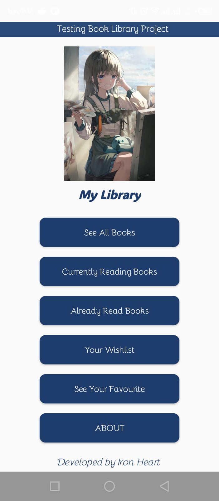
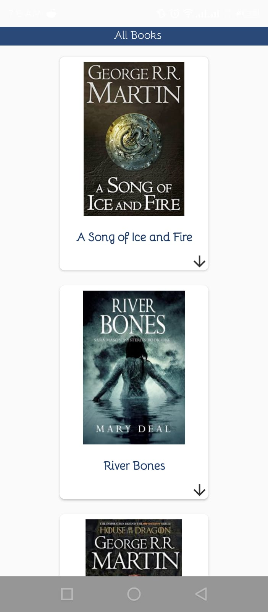
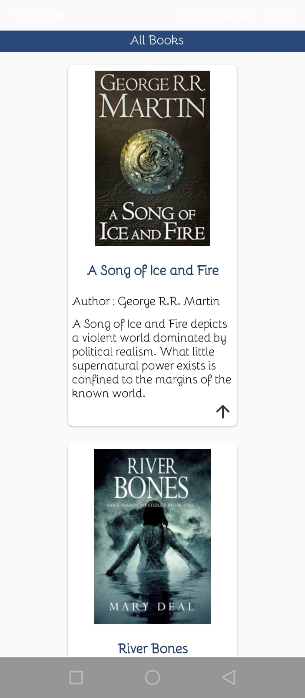
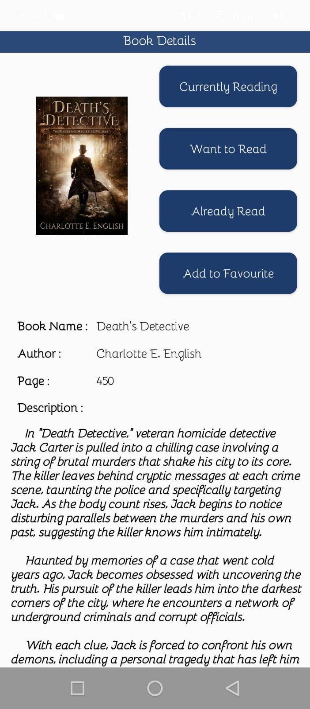
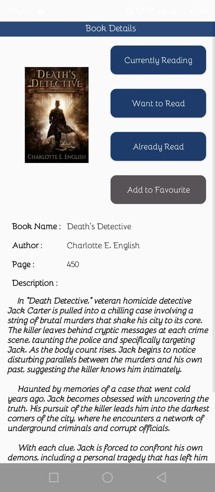
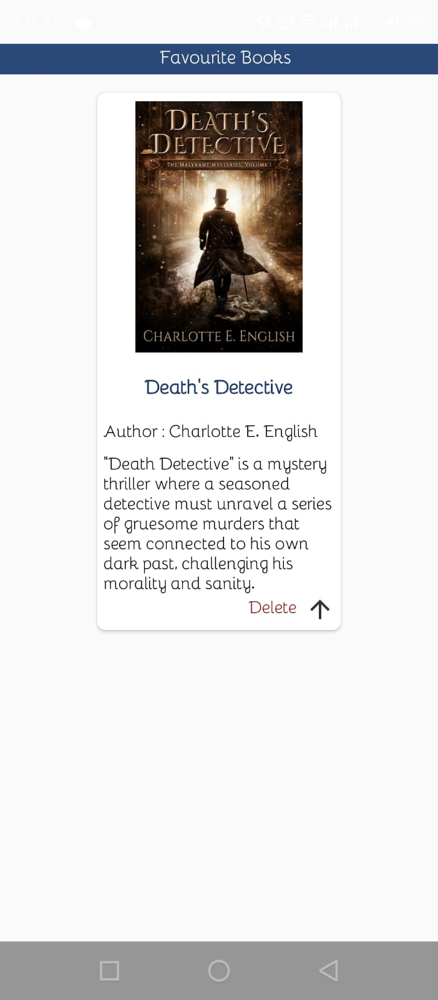

<h1 align="center">Hi 👋, I'm Adnan Hossain Utsaw</h1>

- 🔭 This is my first Android Project 

  <h1>Book Library </h1>
  

        This Android application, built using Java in Android Studio, allows users to maintain a personalized library of books. 
        The app features a <strong>list of books</strong> with details such as the <strong>author</strong> and 
        <strong>number of pages</strong>. Users can click on any book to view more information on the <strong>book details page</strong>.
  

  
On the details page, users have four interactive options:

  <ul>
        <li>Add to Favorites</li>
        <li>Add to Currently Reading</li>
        <li>Add to Already Read</li>
        <li>Add to Wishlist</li>
  </ul>

  

        Once a book is added to one of these categories, users can navigate to the respective category pages to find their selections. 
        Additionally, users can <strong>delete books</strong> from these categories, providing a simple way to manage their library.
  

   
  
 
        This project provides an easy-to-use interface for organizing and tracking books, whether they're currently being read, finished, or saved for later.
        Users can quickly sort books into categories like "Currently Reading", "Wishlist" or "Favourite books" with access to details such as authors and page counts.
        The system allows for simple addition, removal, and updating of book entries, making library management effortless.
   
    
  
   
  

  <h3> Here is a simple view of the application.</h3>
  
  

    
    
    
    
    
    
  

  
  
  
